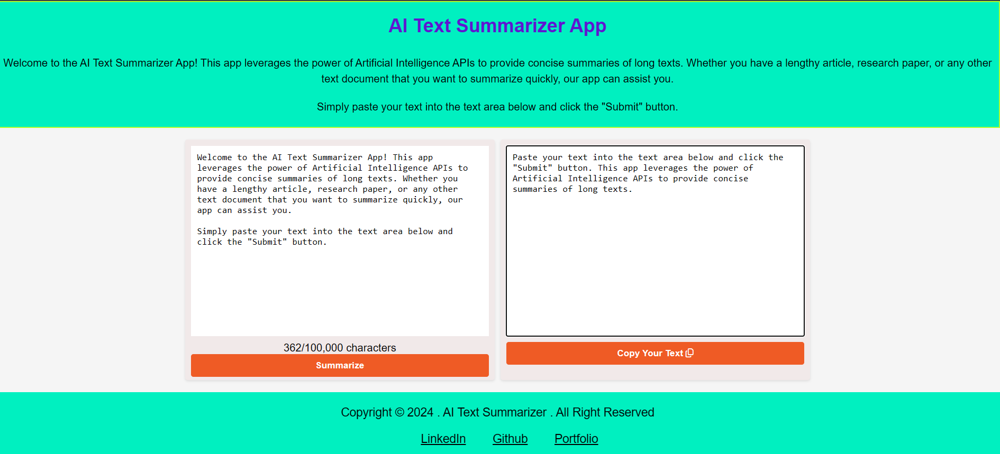

Here’s a **README.md** file you can use for your GitHub repository for the **AI Text Summarizer App** project:

---

# AI Text Summarizer App

🚀 **AI Text Summarizer App** is a web-based tool that generates concise summaries from long paragraphs using Facebook's BART AI model via Hugging Face API. This project allows users to easily input lengthy content, summarize it, and copy the summarized output.

## 📝 Project Overview

The AI Text Summarizer App uses natural language processing to generate a short, coherent summary of any long text or paragraph provided by the user. It's built using the Hugging Face API and utilizes the BART AI model for summarization.

## 🎯 Features

- **Input Area**: Users can write or paste long paragraphs into the input text area.
- **Summarize Button**: When the user clicks the "Summarize" button, an API call to `{{baseUrl}}/summarize` is made with the user's input.
- **Summary Output**: After the API call, the summarized text is displayed in the output area.
- **Copy Button**: Users can copy the generated summary to their clipboard by clicking the "Copy" button.
  
## 🚀 Technology Stack

- **Frontend**:
  - HTML, CSS, JavaScript
- **Backend/API**:
  - Hugging Face API
  - Facebook's BART AI Model
  
## 📦 How It Works

1. **Input Text**: Write or paste a long paragraph into the input text area.
2. **Summarization**: Click on the "Summarize" button, which sends an API request to the Hugging Face BART model.
3. **Display Summary**: The summarized output will appear in the designated output textarea.
4. **Copy Summary**: Click the "Copy" button to copy the generated summary to your clipboard.

## 📚 API Integration

This app uses the Hugging Face API to access Facebook's BART model for text summarization. The API endpoint `{{baseUrl}}/summarize` takes the input text and returns a summarized version, which is displayed to the user.

## 🛠️ Installation & Setup

To run this project locally:

1. Clone this repository:
   ```bash
   git clone https://github.com/your-username/ai-text-summarizer-app.git
   cd ai-text-summarizer-app
   ```
2. Install dependencies:
   ```bash
   npm install
   ```
3. Set up the Hugging Face API Key by creating an `.env` file and adding your API key:
   ```bash
   REACT_APP_HUGGINGFACE_API_KEY=your-api-key
   ```

4. Start the project:
   ```bash
   npm start
   ```

## 🌟 Demo



## 💡 Future Enhancements

- Add language support for multiple languages.
- Implement advanced customization for summary length.
- Enhance UI/UX for better user interaction.

## 🤝 Contributing

Contributions, issues, and feature requests are welcome! Feel free to check the [issues page](#) if you want to contribute.

## 🛡️ License

This project is licensed under the MIT License - see the [LICENSE](LICENSE) file for details.

---
